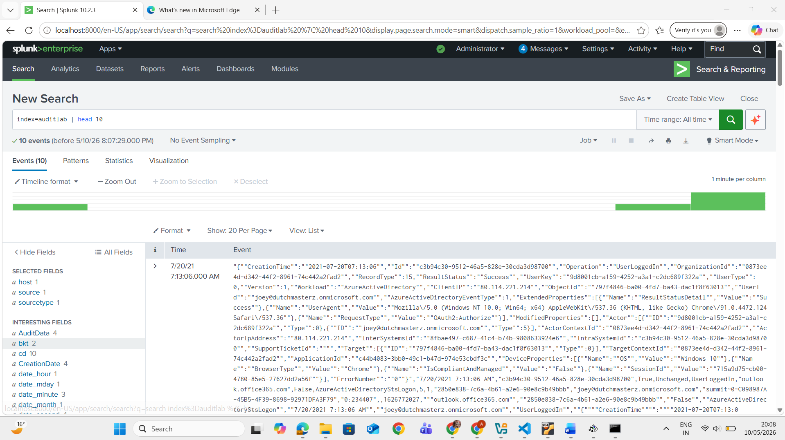

# Lab 01: Log Ingestion And Initial Analysis

## Objective

Verify that audit log data was successfully imported into Splunk and could be searched from the `auditlab` index.

## Environment

- Platform: Splunk
- Data source: Audit log dataset
- Lab type: Controlled educational environment

## Methodology

I opened Splunk Search & Reporting and searched the `auditlab` index to confirm that events were present. The first search returned raw audit events, showing that the dataset had been ingested and was available for investigation.

## Queries Used

```spl
index=auditlab | head 10
```

## Evidence



## Findings

Splunk returned 10 audit events from the `auditlab` index. This confirmed that the dataset was searchable and ready for further analysis.

## Skills Demonstrated

- SPL search
- Log ingestion verification
- Log analysis
- SOC investigation documentation

## Lessons Learned

Before running detection logic, an analyst should first confirm that the dataset is present, searchable, and returning events from the expected index.

## Disclaimer

This lab was completed in a controlled educational environment.
