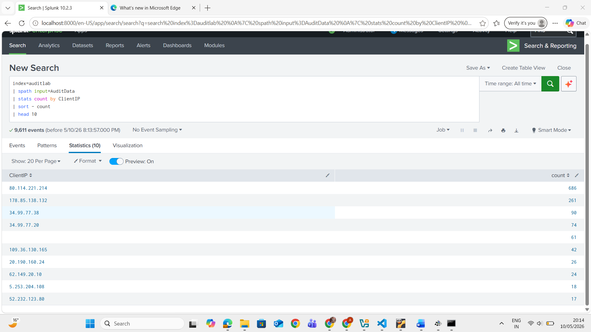

# Lab 02: Top Source IP Analysis

## Objective

Identify the client IP addresses generating the highest number of authentication events in the audit dataset.

## Environment

- Platform: Splunk
- Data source: Audit log dataset
- Lab type: Controlled educational environment

## Methodology

I parsed the `AuditData` field with `spath`, grouped events by `ClientIP`, sorted the results by event count, and reviewed the top 10 client IP addresses.

## Queries Used

```spl
index=auditlab
| spath input=AuditData
| stats count by ClientIP
| sort - count
| head 10
```

## Evidence



## Findings

The most active client IP was `80.114.221.214` with 686 events, followed by `178.85.138.132` with 261 events and `34.99.77.38` with 90 events. High-volume source IPs are useful starting points for authentication activity review and threat hunting.

## Skills Demonstrated

- Statistical analysis with SPL
- JSON field parsing with `spath`
- Source IP review
- Security event review

## Lessons Learned

Grouping authentication events by source IP helps identify unusual concentrations of activity that may need further investigation.

## Disclaimer

This lab was completed in a controlled educational environment.
