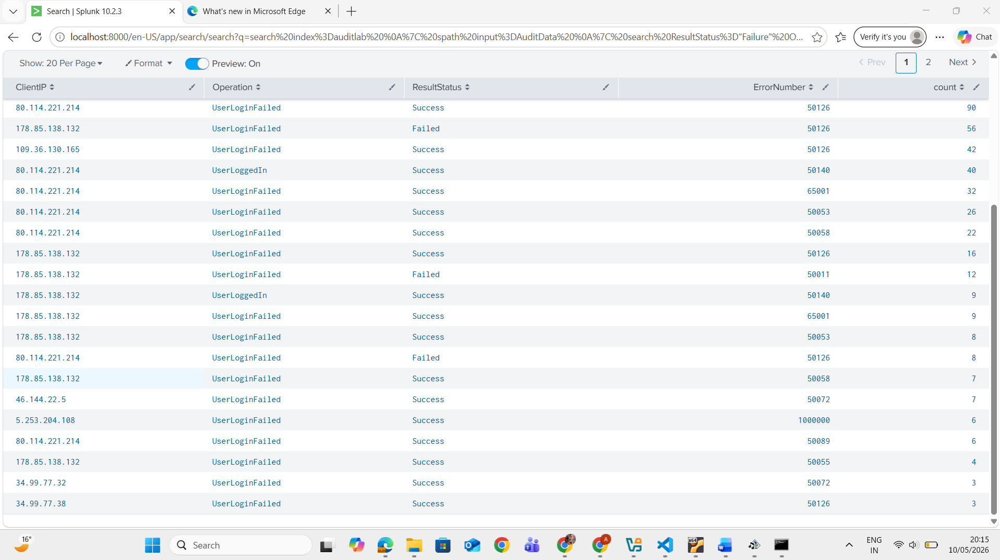

# Lab 03: Failed Login Investigation

## Objective

Investigate failed authentication activity and identify suspicious login behavior using Splunk.

## Environment

- Platform: Splunk
- Data source: Audit log dataset
- Lab type: Controlled educational environment

## Methodology

I parsed the audit data, filtered for failed authentication results, and grouped the results by client IP, operation, result status, and error number. This helped identify repeated failed login behavior and related error codes.

## Queries Used

```spl
index=auditlab
| spath input=AuditData
| search ResultStatus="Failure"
| stats count by ClientIP Operation ResultStatus ErrorNumber
```

## Evidence



## Findings

The investigation showed repeated `UserLoginFailed` activity from multiple client IP addresses. The results included failure-related error codes such as `50126`, `50011`, and other authentication error values. Repeated failed login activity can indicate brute-force attempts, credential misuse, or abnormal authentication behavior.

## Skills Demonstrated

- Authentication investigation
- SPL investigation
- Failed login analysis
- Findings documentation

## Lessons Learned

Failed login analysis should combine event counts, client IPs, operations, and error codes so that suspicious authentication patterns can be prioritized for escalation.


